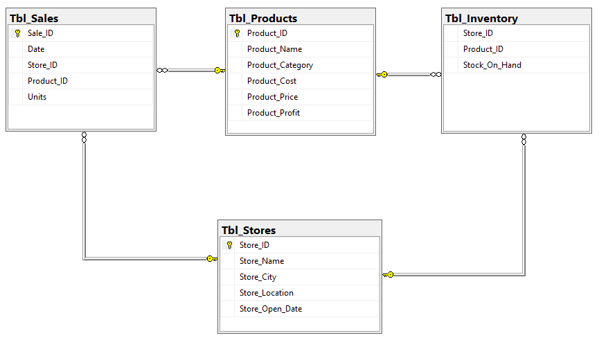

# Maven Toys Sales and Inventory Analysis
A SQL project that aim to provide Maven Toys, a fictional chain of toy stores in Mexico, with actionable insights into product profitability, seasonal sales trends, stock outs impact, and inventory efficiency.

## Table of Content

- [Project Overview](https://github.com/OchukoEjemudaro/Maven-Toys-Sales-Analysis#project-overview)
- [Project Scope](https://github.com/OchukoEjemudaro/Maven-Toys-Sales-Analysis#project-scope)
- [Business Objective](https://github.com/OchukoEjemudaro/Maven-Toys-Sales-Analysis#business-objective)
- [Document Purpose](https://github.com/OchukoEjemudaro/Maven-Toys-Sales-Analysis#document-purpose)
- [Use Case](https://github.com/OchukoEjemudaro/Maven-Toys-Sales-Analysis#use-case)
- [Skills Demostrated](https://github.com/OchukoEjemudaro/Maven-Toys-Sales-Analysis#skills-demostrated)
- [Data Source](https://github.com/OchukoEjemudaro/Maven-Toys-Sales-Analysis#data-source)
- [Data Cleaning and Processing](https://github.com/OchukoEjemudaro/Maven-Toys-Sales-Analysis#data-cleaning-and-processing)
- [Data Analysis and Insight](https://github.com/OchukoEjemudaro/Maven-Toys-Sales-Analysis#data-analysis-and-insight)
- [Recommembdation](https://github.com/OchukoEjemudaro/Maven-Toys-Sales-Analysis#recommendation)
- [Conclusion](https://github.com/OchukoEjemudaro/Maven-Toys-Sales-Analysis#conclusion)

## Project Overview
The Maven Toy Sales and Inventory Analysis project aim to provide Maven Toys, a fictional chain of toy stores in Mexico, with actionable insights into product profitability, seasonal sales trends, stockouts impact, and inventory efficiency.

This project aims to conduct a thorough analysis of Maven Toys' data to identify key areas for improvement and optimization.

## Project Scope

This project encompasses a detailed analysis of Maven Toys' sales and inventory data, including products, stores, daily sales, and inventory levels. The analysis covers historical data from January 1, 2022 to September 30, 2023 to provide a comprehensive view of Maven Toys' operational performance.

## Business Objective

The main goals of the Maven Toys Sales and Inventory project are to find the product categories that bring in the most profits and check if these categories are consistently profitable in all store locations. Additionally, aim to discover patterns and trends in sales over different time periods, identify any potential loss of sales due to out-of-stock products at specific locations, and determine the amount of money tied up in inventory at the toy stores and how long it will last.

## Document Purpose

This documentation serves as a guide for project stakeholders, providing insights into the project's objectives, data sources, data analysis, and any other relevant information. 

## Use Case

Different stakeholders within the organization could leverage these findings to enhance their respective functions. Here are key stakeholders who could make use of this analysis and benefit from it.

**1. Maven Toys Executives and Management:** Executives and upper management can use the analysis to make informed decisions about product offerings, store locations, and overall business strategy.

**2. Store Managers:** Store managers can benefit from insights into product performance, seasonal trends, and inventory management strategies to optimize their individual store operations.

**3. Inventory Managers:** Those responsible for inventory can use the analysis to refine stocking strategies, identify slow-moving items, and reduce instances of stockouts.

**4. Marketing Teams:** Marketing teams can leverage the analysis to tailor promotional strategies, especially during peak seasons, and align marketing efforts with the most profitable product categories.

**5. Sales Teams:** Sales teams can benefit from understanding customer preferences, popular products, and identifying potential sales opportunities based on the analysis.

## Skills Demostrated
- Data Connection in Microsoft SQL Server
- Data Cleaning and Processing
- Developed a Database Schema
- Data Analysis
- Join
- CTE (Common Table Expression)
- SQL Window Functions

## Data Source

The project utilizes a dataset containing information on sales and inventory. The dataset used for this analysis was downloaded from [Maven Analytics](https://www.mavenanalytics.io/data-playground?page=7&pageSize=5) website where datasets are available for practice purpose. The dataset is a CSV file and it consist four main tables which are sales table, product table, inventory table, and store table.

The sales table comprises 829,262 rows and 5 columns, capturing information about products sold and their quantities. This table serves to provide insights into daily sales activities, featuring columns such as Sale ID, Date, Store ID, Product ID, and Units.

The product table encompasses 35 rows and 5 columns, providing details about the products offered by Maven Toys. Each product is uniquely identified by a Product ID, and the table includes information such as Product Name, Product Category, Product Cost, and Product Price.

Inventory table consists of 1,593 rows and 3 columns, detailing the current stock levels of each product in every store. The columns include Product ID, Store ID, and Stock on Hand.

Store table comprises 50 rows and 5 columns, featuring information about Maven Toys' stores. The columns include Store ID, Store Name, Store City, Store Location, and Store Open Date.

All tables were then imported into Microsoft SQL Server.

## Data Cleaning and Processing

Data cleaning is essential because the quality of analysis and insights derived from data depends heavily on the accuracy and reliability of the input data. Flawed or inconsistent data can lead to incorrect conclusions and hinder decision-making. By thoroughly cleaning and preparing the data, I can ensure that my analyses are based on a solid foundation, leading to more reliable results and informed decision-making.

Thorough data cleaning processes were executed on every table involved in the analysis. The following procedures were undertaken for each table to ensure high data integrity, data accuracy and enhance high quality of the dataset.

**1. Identification and Handling of Null Values:** 

Rigorous checks were performed to identify and appropriately handle any instances of null values on the key columns within each table. Null values in this dataset indicate missing or incomplete information. Therefore, addressing rows with null values helps preserve the overall integrity of the dataset by ensuring that each observation contains complete information. Analyzing incomplete data may lead to misleading results. 

Upon executing a query to identify null values in each table, the resulting output confirms that every table involve in this analysis contains complete information. Importantly, there are no instances of null values detected in the key columns across all tables, highlighting the completeness and data integrity of the dataset used for this analysis.

**2. Dealing with Duplicates:**

Identified and removed duplicate records to avoid redundancy and maintain data integrity.

After running a query to find and remove all duplicate rows in each table, it has been confirmed that every table used in this analysis is free of duplicate rows. Each row in these tables contains unique information, ensuring the integrity of the dataset and providing distinct and valuable data for the analysis.

**3. Validation of Spelling and Categorization:**

A meticulous review was conducted to validate the correctness of spellings and the accuracy of categorization within each table, ensuring consistency and reliability.

**4. Correcting Data Types:**

Ensured that data types are appropriate for the values in each column, converting datatype if needed.

**5. Standardizing Data:**

Ensuring consistency in the format and representation of data, such as standardizing date formats and text case.

The following processes were also carried out during data processing.

- **Added a new Column**

A new column called "product profit" was added to the product table, calculating the profit for each product. This column is crucial for figuring out which product category is making the most profit, providing valuable insights into the most financially rewarding product categories.

New columns were also added to the sales table. These are Weekday, Month Number, Month Name, and Year, these additions are crucial for a thorough look at sales trends. With these columns, businesses can easily see patterns like which days, months, or years have higher sales. This information helps make smart decisions about things like stocking up on products, planning promotions, and overall business strategies.

- **Established Relationships Between Tables**

Creating relationships between tables is crucial for this analysis. It not only keeps the data organized but also helps in making queries faster, avoiding unnecessary duplication of data, and building a flexible database structure


Relationships enable the use of JOIN operations in queries, allowing data from multiple tables to be combined and retrieved in a single query. This leads to more efficient and streamlined data retrieval. By establishing relationships, it helps to avoid duplicating information in multiple tables and make the database more efficient in terms of storage and easier to maintain. Relationships provide a clear representation of the connections between different entities in the database. This makes the database structure more understandable and facilitates effective data modeling.

For the complete data cleaning documentation, [Click Here](https://github.com/OchukoEjemudaro/Maven-Toys-Sales-Analysis/blob/main/Maven_Toy_Sales_Data_Cleaning_and_Procesing.pdf)

# Data Analysis and Insight

The objectives of this project are to find the product categories that bring in the most profits and check if these categories are consistently profitable in all store locations. Additionally, to discover patterns and trends in sales over different time periods, identify any potential loss of sales due to out-of-stock products at specific locations, and determine the amount of money tied up in inventory at the toy stores and how long it will last.

This analysis provides answers to the following questions.

**1. Which product categories drive the biggest profits? Is this the same across store locations?**

This question is seeking to understand the relationship between product categories, profitability, and potential variations across different store locations. 

The first part of the question aims to identify and prioritize product categories that contribute significantly to the overall profitability of the business. To address this question, a thorough SQL query was executed to calculate the overall profit generated by each product category, along with the percentage contribution of each category to the total profit. This query provides a comprehensive overview of the profitability distribution across product categories.


```SQL
--Profit by Product Category

SELECT		Product_Category,
		ROUND(SUM(Product_Profit*Tbl_Sales.Units), 0) AS Total_Profit,
		ROUND(SUM(Product_Profit*Tbl_Sales.Units)/(SELECT SUM(Product_Profit*Tbl_Sales.Units) 
		FROM	Tbl_Products
		JOIN	Tbl_Sales
		ON	Tbl_Products.Product_ID = Tbl_Sales.Product_ID)*100,2) AS [%Profit]
FROM		Tbl_Products
JOIN		Tbl_Sales
ON		Tbl_Products.Product_ID = Tbl_Sales.Product_ID
GROUP BY	Product_Category
ORDER BY	SUM(Product_Profit*Tbl_Sales.Units) DESC
```
|Product_Category|Total_Profit|%Profit|
|----------------|------------|-------|
|Toys|1079527|26.89|
|Electronics|1001437|24.95|
|Art & Crafts|753354|18.77|
|Games|673993|16.79|
|Sports & Outdoors|505718|12.6|

- From the above analysis, Toys generated the highest profit among the mentioned categories, totaling $1,079,527, contributing 26.89% of the total profit. This indicates that the Toys category is a significant contributor to the overall profitability.
- Electronics and Art & Crafts follow closely behind Toys in terms of profitability, with profits of $1,001,437 and $753,354, contributing 24.95% and 18.77% of the total profit respectively. These categories are also substantial contributors to the overall profit.
- Games and Sports & Outdoors generated profits of $673,993 and $505,718, contributing 16.79% and 12.60% of the total profit respectively. While still contributing significantly to the overall profit, they are less profitable compared to Toys, Electronics, and Art & Crafts.

The second part of the question explores whether the profitability of product categories remains consistent or varies across different store locations. It suggests an investigation into whether certain product categories perform exceptionally well in specific stores or if the profitability distribution is uniform across all locations. To provide answer to the second part of the question, a comprehensive SQL query that calculate the total profit generated by each product category across different store location was executed.

```SQL
--Profit by Product Category and Store Location

WITH CTE
AS
(SELECT		Store_Location,
		Product_Category,
		ROUND(SUM(Product_Profit*Tbl_Sales.Units), 0) AS Total_Profit
FROM		Tbl_Products
JOIN		Tbl_Sales
ON		Tbl_Products.Product_ID = Tbl_Sales.Product_ID
JOIN		Tbl_Stores
ON		Tbl_Stores.Store_ID = Tbl_Sales.Store_ID
GROUP BY	Product_Category,
		Store_Location)
SELECT		Store_Location,
		[Toys],
		[Electronics],
		[Art & Crafts],
		[Games],
		[Sports & Outdoors]   
FROM		CTE
PIVOT(		SUM (Total_Profit)
		FOR Product_Category
		IN  ([Toys], [Electronics], [Art & Crafts], [Games], [Sports & Outdoors])) AS PIV
ORDER BY	Store_Location
```

|Store_Location|Toys|Electronics|Art & Crafts|Games|Sports & Outdoors|
|--------------|----|-----------|------------|-----|-----------------|
|Airport|88250|108197|61441|80768|39393|
|Commercial|225034|287574|155461|146296|112499|
|Downtown|630029|502490|444320|378421|293468|
|Residential|136214|103176|92132|68508|60358|

- From the above analysis, profitability for each product category varies significantly across different store locations. Each location has a different top-performing category in terms of profitability. In Airport location, Electronics is the top-performing category. In Commercial location, Electronics is also the top-performing category. In Downtown location, Toys is the top-performing category while in Residential location, Toys is also the top-performing category.
- Electronics emerges as the dominant and most profitable category in both Airport and Commercial locations. This suggests a higher demand for electronics products in these settings, possibly driven by the traveler demographic in airports and the commercial nature of the business district.
- The Toys category consistently appears as the top-performing category in both Downtown and Residential locations, indicating its strong market appeal in these settings.

**2. Can you find any seasonal trends or patterns in the sales data?**

To identify seasonal trends or patterns in the sales data, an in-depth time-based analysis was conducted to uncover seasonal trends and patterns in the sales data, aiming to gain valuable insights into the evolving behaviors, trends, and overall patterns within the dataset over time. This endeavor involved the execution of a comprehensive SQL query designed to calculate the total revenue for each month across different years, enabling a sophisticated understanding of the complex behaviors and fluctuations within the sales data throughout different years.

```SQL
--Revenue Trend Overtime

SELECT		Month_Name,
		CASE WHEN [2022] IS NULL THEN 0 ELSE [2022] END AS [2022],
		CASE WHEN [2023] IS NULL THEN 0 ELSE [2023] END AS [2023]
FROM
(SELECT 	Month_Name,
		Month_Number,
		[Year],
		ROUND(SUM(Product_Price*Tbl_Sales.Units), 0) AS Revenue
FROM	 	Tbl_Products
JOIN	  	Tbl_Sales
ON	 	Tbl_Products.Product_ID = Tbl_Sales.Product_ID
JOIN	  	Tbl_Stores
ON	  	Tbl_Stores.Store_ID = Tbl_Sales.Store_ID
GROUP BY 	Month_Name,
		Month_Number,
		[Year]) AS R
PIVOT(		SUM(Revenue)
		FOR [Year]
		IN ( [2022], [2023])) AS PIVOT_
ORDER BY 	Month_Number
```

|Month_Name|2022|2023|
|----------|----|----|
|January|542555|747196|
|February|541352|722632|
|March|589485|883516|
|April|681073|827691|
|May|672370|825319|
|June|661980|808299|
|July|556034|828349|
|August|489423|660877|
|September|585844|658194|
|October|623874|0|
|November|661304|0|
|December|877204|0|

**In 2022**
- From January to December, there is a general revenue growth, reaching a peak in December at $877,204. This indicates positive consumer engagement and purchasing during this year.
- August show a slight decline in revenue compared to the preceding months, potentially influenced by seasonal factors or changes in consumer behavior during the summer period.
- September marks a recovery with an increase in revenue to $585,844, suggesting a potential uptick in consumer spending as the summer concludes.
- October and November maintain stable revenue, with $623,874 and $661,304, respectively. 
- December stands out with a significant spike in revenue, reaching $877,204. This could be attributed to increased holiday spending, festive promotions, or special events.

**In 2023**
- The first quarter of the year, from January to March, exhibits consistent revenue growth, reaching a peak in March at $883,516. This suggests positive consumer engagement and purchasing during the early months of the year.
- April and May maintain stable revenue levels, indicating sustained consumer interest and spending during the spring season.
- From June onwards, there is a gradual decline in revenue, reaching its lowest point in September at $658,194. This decline could be influenced by various factors such as seasonal trends, changing consumer preferences, or market dynamics.
- October, November, and December, the recorded revenue sharply declined, ultimately reaching zero. This decline was primarily attributed to the absence of sales during this period.

Following the initial examination, I conducted a comprehensive SQL query designed to thoroughly explore the dataset. An SQL query that calculate the percentage change in revenue for a specific month compared to the same period in the previous year was executed. This query helps assess how revenue in that particular month has changed over time, providing a clear understanding of the trends. The primary objective was to identify specific months where revenue exhibited either an increase or decrease compared to the corresponding months from the previous year. This detailed exploration aimed to unveil subtle patterns within the revenue dynamics over time, providing nuanced insights into the specific months that demonstrated notable changes compared to the same periods in the previous year.

```SQL
--% Change in Revenue for a Specific Month Compared to Same Period in the Previous Year.

;WITH CTE
AS
(SELECT		Month_Name,
		Month_Number,
		CASE WHEN [2022] IS NULL THEN 0 ELSE [2022] END AS [2022],
		CASE WHEN [2023] IS NULL THEN 0 ELSE [2023] END AS [2023]
FROM
(SELECT 	Month_Name,
		Month_Number,
		[Year],
		ROUND(SUM(Product_Price*Tbl_Sales.Units), 0) AS Revenue
FROM	 	Tbl_Products
JOIN	  	Tbl_Sales
ON	 	Tbl_Products.Product_ID = Tbl_Sales.Product_ID
JOIN	  	Tbl_Stores
ON	  	Tbl_Stores.Store_ID = Tbl_Sales.Store_ID
GROUP BY 	Month_Name,
		Month_Number,
		[Year]) AS R
PIVOT(		SUM(Revenue)
		FOR [Year]
		IN ( [2022], [2023])) AS PIVOT_)
SELECT		Month_Name,
		[2022],
		[2023],
		ISNULL(ROUND((([2023]-[2022])/NULLIF([2022],0))*100,2),0) AS [% Change In Revenue]
FROM 		CTE
ORDER BY 	Month_Number
```

|Month_Name|2022|2023|% Change ln Revenue|
|----------|----|----|-------------------|
|January|542555|747196|37.72|
|February|541352|722632|33.49|
|March|589485|883516|49.88|
|April|681073|827691|21.53|
|May|672370|825319|22.75|
|June|661980|808299|22.1|
|July|556034|828349|48.97|
|August|489423|660877|35.03|
|September|585844|658194|12.35|
|October|623874|0|-100|
|November|661304|0|-100|
|December|877204|0|-100|

The revenue generated for each month, comparing 2022 to 2023, provides insights into the performance of each period:
- The first half of the year (January, February, March, April, May, and June) experienced substantial revenue growth, with increases ranging from approximately 22% to 49.88%. These months show a positive trend in generating higher revenue compared to the same period in the previous year. Notably, March sees a significant increase of 49.88%, indicating a strong performance during this period. 
- In the second half of the year, July and August witnessed growth, but the percentages are notably different. July's revenue increased by 48.97%, while August saw a growth of 35.03%. September still shows positive growth, but the growth rate is comparatively lower. In the last quarter of 2023, specifically in October, November, and December, the recorded revenue sharply declined, ultimately reaching zero. This decline was primarily attributed to the absence of sales during this period.

**3. Are sales being lost with out-of-stock products at certain locations?**

This implies an inquiry into the potential revenue impact caused by the absence of available products in specific locations. It seeks to understand the financial losses incurred when products are unavailable or out of stock in certain location. When customers are unable to purchase desired items due to stockouts, the business miss out on potential sales opportunities, resulting in lost revenue.

To provide answer to this question, an analysis needs to be conducted to identify the following:

**I. Potential Revenue:**

This represents the total revenue potential for each location, considering the availability of all products. It offers insights into the overall revenue that each location could have generated if all products were in stock.

**II. Actual Revenue:**

This signifies the aggregate revenue generated in each location, taking into account the available products.

**III. Revenue Lost During Stock Out:**

This entails identifying lost revenue during periods of product unavailability. It involves quantifying the revenue that could have been generated solely from out-of-stock products if they were readily available for purchase. The inability of customers to buy these items due to stockouts translates into missed revenue opportunities, constituting lost revenue for the business.

**IV. Percentage of Lost Revenue:**

This calculates the percentage of revenue lost as a result of product unavailability due to stockouts. This percentage is valuable because it gives stakeholders a clear understanding of how much of the potential revenue was not realized due to out-of-stock products. It helps quantify the impact of stockouts on overall sales performance, and it provides a basis for comparison across different stores.

All of these contribute to evaluating the influence of out-of-stock products on the overall sales performance in each location.

**_NOTE_**: Sales table contain some certain products but these products are not listed in the inventory table, therefore, they are categorized as unavailable products. Despite their absence from the inventory table, these products play a crucial role in this analysis. Their inclusion is essential for calculating the total revenue lost during stock out.

```SQL
-- This Query Assesses the Impact of Out-of-Stock Product on Overall Sales in Each Store Location.

WITH 

Potential_Revenue
AS
(SELECT		Store_Location,
		ROUND(SUM(Tbl_Products.Product_Price*Tbl_Sales.Units),0) AS Potential_Revenue
FROM		Tbl_Sales
JOIN		Tbl_Products
ON		Tbl_Sales.Product_ID = Tbl_Products.Product_ID
JOIN		Tbl_Stores
ON		Tbl_Stores.Store_ID = Tbl_Sales.Store_ID
GROUP BY 	Store_Location),
		
Actual_Revenue
AS
(SELECT		Store_Location,
		ROUND(SUM(Tbl_Products.Product_Price*Tbl_Sales.Units),0) AS Actual_Revenue
FROM		Tbl_Sales
JOIN		Tbl_Products
ON		Tbl_Sales.Product_ID = Tbl_Products.Product_ID
JOIN		Tbl_Stores
ON		Tbl_Stores.Store_ID = Tbl_Sales.Store_ID
LEFT JOIN	Tbl_Inventory
ON		Tbl_Inventory.Store_ID = Tbl_Sales.Store_ID
		AND Tbl_Inventory.Product_ID = Tbl_Sales.Product_ID
WHERE		Tbl_Inventory.Stock_On_Hand > 0
GROUP BY 	Store_Location),

Lost_Revenue
AS
(SELECT		Store_Location,
		ROUND(SUM(Tbl_Products.Product_Price*Tbl_Sales.Units),0) AS Lost_Revenue
FROM		Tbl_Sales
JOIN		Tbl_Products
ON		Tbl_Sales.Product_ID = Tbl_Products.Product_ID
JOIN		Tbl_Stores
ON		Tbl_Stores.Store_ID = Tbl_Sales.Store_ID
FULL JOIN	Tbl_Inventory
ON		Tbl_Inventory.Store_ID = Tbl_Sales.Store_ID
		AND Tbl_Inventory.Product_ID = Tbl_Sales.Product_ID
WHERE		Tbl_Inventory.Stock_On_Hand is null 
		OR
		Tbl_Inventory.Stock_On_Hand = 0
GROUP BY	Store_Location)

-- Combine the Information to Calculate the Percentage of Revenue Lost
SELECT		Potential_Revenue.Store_Location, 
		Potential_Revenue, 
		Actual_Revenue, 
		Lost_Revenue,
		ROUND((Lost_Revenue.Lost_Revenue/Potential_Revenue.Potential_Revenue    )*100,2) AS [%_Lost_Revenue]
FROM		Potential_Revenue
JOIN		Actual_Revenue
ON		Potential_Revenue.Store_Location = Actual_revenue.Store_Location
Join		Lost_Revenue
ON		Potential_Revenue.Store_Location = Lost_Revenue.Store_Location
ORDER BY 	Store_Location
```

|Store_Location|Potential_Revenue|Actual_Revenue|Lost_Revenue|%_Lost_Revenue|
|--------------|-----------------|--------------|------------|--------------|
|Airport|1289723|1267823|21899|1.7|
|Commercial|3279139|3208312|70828|2.16|
|Downtown|8219596|7963937|255659|3.11|
|Residential|1656114|1570875|85239|5.15|

- From the analysis above, the percentage of lost revenue in Airport is relatively low (1.7%), suggesting a minor impact on revenue due to product unavailability. This location experienced the lowest percentage of lost revenue among the listed locations.
- The percentage of lost revenue in Commercial is moderate (2.16%), indicating a moderate impact on revenue. While not the lowest, the impact is still manageable.
- In Downtown location, the percentage of lost revenue is relatively high (3.11%), indicating a more significant impact on overall revenue. 
- Residential location has the highest percentage of lost revenue (5.15%), suggesting a substantial impact on revenue
- Across all locations, the actual revenue falls short of potential revenue, indicating that revenue could have been higher if all products were available.

**4. How much money is tied up in inventory at the toy stores? How long will it last?**

This involve an analysis of the financial resources that are currently invested in the inventory of Maven Toys stores and an estimation of how long it takes, on average, to sell and replace that inventory.

The first part of the question aims to identify the total monetary value of the toys and products that are currently held in the inventory of the toy stores. To provide an answer to the first part of the question, SQL query that performs a comprehensive valuation of the inventory by multiplying the cost per unit of each individual product by its corresponding quantity in stock was executed.

```SQL
--Total Monetary Value

SELECT	ROUND(SUM(Tbl_Products.Product_Cost * Tbl_Inventory.Stock_On_Hand),0) AS Money_Tied_Up_In_Inventory
FROM	Tbl_Inventory
JOIN	Tbl_Products
ON	Tbl_Inventory.Product_ID = Tbl_Products.Product_ID
```
|Money_Tied_Up_In_Inventory|
|----------|
|300210|

- From the above analysis, the money tied up in inventory at toy stores is $300,210, it means that the total value of the inventory of products in toy stores is $300,210. This amount represents the capital invested in purchasing those products, and it is currently tied up in the form of inventory.

The second part of the question explores the average number of days it takes for the toy stores to sell and replace their entire inventory. This was calculated by first calculating the total quantity of products currently in stock. Subsequently, this total quantity is divided by the average unit of product sold per day. This calculation aids in determining the number of days it takes, on average, for the toy stores to completely sell their existing inventory and replenish it.

```SQL
--Average Number of Days it Takes for the Toy Stores to Sell and Replace their Entire Inventory

WITH 

Avg_Units
AS
(SELECT		ID,
		AVG(Total_Unit_Sold_Per_Day) AS Avg_Units_Sold
FROM
(SELECT		[Date],
		SUM(Tbl_Sales.Units) AS Total_Unit_Sold_Per_Day,
		ROW_NUMBER() OVER(PARTITION BY [Date] ORDER BY [Date]) AS ID
FROM 		Tbl_Sales
GROUP BY 	[Date]) AS Units_Sold 
GROUP BY 	ID),

Total_Stock
AS
(SELECT		ID,
		SUM(Total_Stock_on_Hand) Total_Stock
FROM
(SELECT		Store_ID,
		SUM(Tbl_Inventory.Stock_On_Hand) AS Total_Stock_on_Hand,
		ROW_NUMBER() OVER (Partition BY Store_ID Order By Store_ID) AS ID
FROM 		Tbl_Inventory
GROUP BY  	Store_ID) AS Total_Stock_in_Store
GROup BY 	ID)

SELECT		(Total_Stock.Total_Stock/Avg_Units.Avg_Units_Sold) AS Avg_No_of_Days
FROM 		Avg_Units
JOIN 		Total_Stock
ON 		Avg_units.ID = Total_Stock.ID
```

|Avg_No_of_Days|
|----------|
|17|

Average number of days it takes for the toy stores to sell and replace their entire inventory is 17 days. This suggest that;

- The toy stores are efficiently selling and replenishing their inventory.
- The toy stores are responsive to customer demand. Products are moving swiftly, and the stores are able to restock and adapt to market demands in a timely manner.

This is a positive indicator of efficient operations and responsiveness to market dynamics. It reflects well on the toy stores' ability to manage their inventory effectively and align with customer demand.

## Recommendation
- Segment customers based on preferences and purchasing behavior within each category. Tailor marketing messages and promotions to specific customer segments, enhancing the likelihood of increased sales and customer loyalty.
- Develop targeted marketing campaigns for the top-performing categories to enhance visibility and customer engagement. Highlight unique selling propositions and promotions to drive sales within these categories.
- Allocate additional resources, marketing efforts, and inventory management focus to capitalize on the high profitability of top-performing categories, such as Toys, Electronics, and Art & Crafts.
- Given the dominance of Electronics in both Airport and Commercial locations, consider expanding the electronics product line, introducing new models, and leveraging promotions to further capitalize on customer demand in these areas.
- Arts and Crafts is a strong performer in Downtown and Residential locations. Invest in promoting creative and artistic products, collaborate with local artists, and create thematic displays to enhance the appeal of this category.
- Consider strategic investments in areas that show consistent positive growth. This could involve expanding product lines, entering new markets, or enhancing online presence based on identified growth opportunities.
- Encourage collaboration between sales, marketing, and operations departments to ensure alignment in strategies and coordinated efforts.
- Develop targeted marketing and sales strategies aligned with seasonal fluctuations, with a focus on maximizing revenue during peak months. Consider promotions, special events, or product launches during these periods.
- Enhance inventory management practices to reduce instances of stockouts.
- Maintain safety stock levels for high-demand products to act as a buffer during unexpected spikes in demand or delays in restocking. This ensures that even during fluctuations, essential products remain available for customers.
- Strengthen collaboration with suppliers to ensure a seamless and timely replenishment process. Consider negotiating favorable terms for quick and reliable deliveries to support the efficient turnover.

## Conclusion

The detailed analysis of Maven Toys' sales and inventory data yields vital insights for strategic decision-making. Identifying profitable product categories, recognizing seasonal trends, addressing out-of-stock impacts, and optimizing inventory turnover pave the way for proactive responses to market dynamics. This positions Maven Toys for sustained success in the dynamic Mexican toy retail market.

Thank You For Reading

---

I’m interested in a Data Analyst role in an organization where I can showcase my skills, take more responsibilities, continue to learn, an organization that I can grow with, where my work will be highly beneficial to the organization.

You can reach me on ochukoejemudaro@gmail.com or [Twitter](https://twitter.com/iamochuks/) or [LinkedIn](https://www.linkedin.com/in/ochukoejemudaro01/)

THANK YOU


